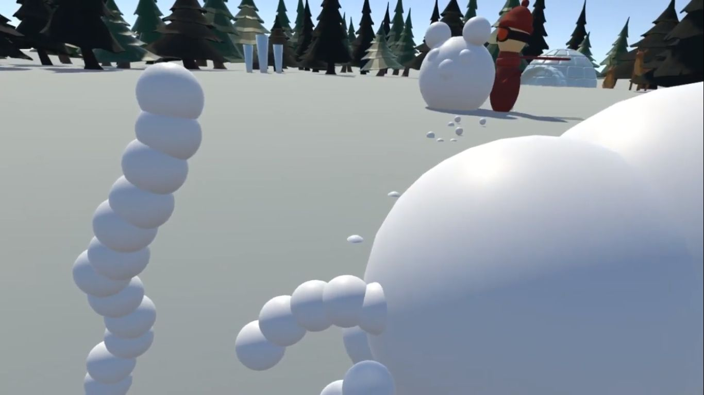

Als ein wahrer Besuchermagnet entpuppte sich dieses Spiel. Zwei Spieler bewerfen sich in der virtuellen Realität mit Schneebällen. Zum Schutz können sie sich eine Deckung errichten. Doch Vorsicht, die Deckung kann durch Schneebälle des Gegners wieder eingeworfen werden.

Besonders fordernd in diesem Projekt war die Vektormathematik. Die Art und Weise, wie sich die Schneebälle zu einer Deckung formen, war sehr speziell und nichts, was sich mit der eingebauten Physik-Engine von Unity so einfach hätte lösen lassen. Also entschied ich, die Physik selbst zu programmieren.

Diese Implementierung ermöglichte das Zusammensetzen komplexer Strukturen. Der verblüffende Erfolg der eigenen Umsetzung: wird ein Schneeball inmitten des Baus zerstört, so fallen alle darauf gebauten Schneebälle physikalisch korrekt zu Boden und setzen sich beim Aufeinanderprallen zu einer neuen Konstellation zusammen.

Bei der immensen Menge der entstehenden Schneebälle war es außerdem unabdingbar, auch die Netzwerkkommunikation zu optimieren. Die Berechnung der Physik übernahmen beide Clients lokal. Nur wenn es eine Interaktion der Schneebälle mit dem gegnerischen Spieler gab, wurden Netzwerk-Nachrichten abgesendet.

Viel Dank gilt meinen Teamkollegen: Christin Schwarzer und Erik Masson für die 3D-Modelle und Animationen, Jendrik Stührenberg für seine Unterstützung bei der Programmierung sowie Sebastian Fick für das Projektmanagement.

Ein Video der abgegebenen Spiel-Version ist unter folgendem Link einzusehen: [https://youtu.be/Sqn1rD50S5Q](https://youtu.be/Sqn1rD50S5Q)
